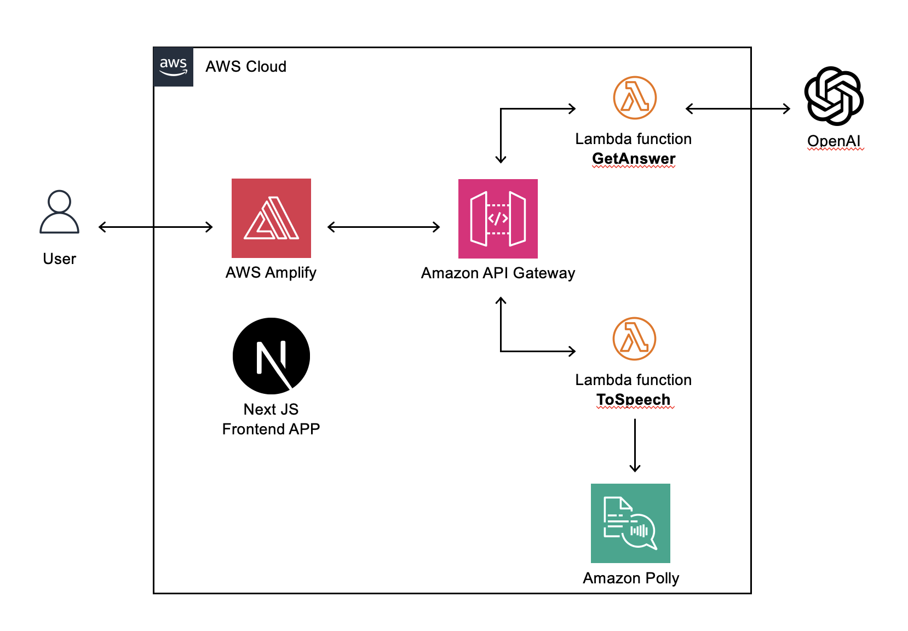
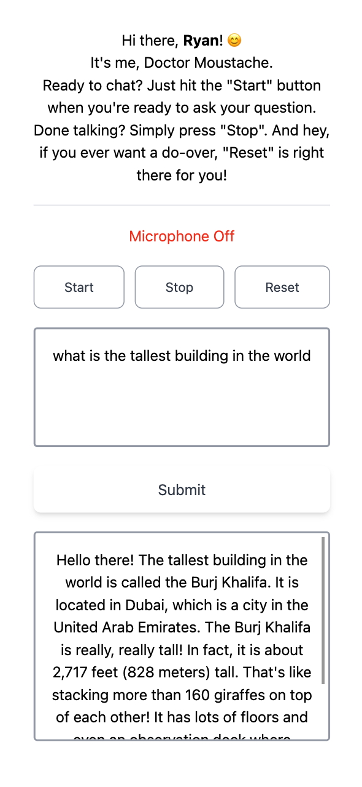

  

  <h3 align="center">Doctor Brown</h3>
  

    This is a web application utilizing Next.js and Tailwind CSS, hosted securely on AWS.
     
     
    <a href="/">See My Application</a>
    ·
    <a href="/">Report Bug</a>
  

**Software Development Plan for Child-AI Verbal Interaction Web Application**

- **Background**

  - Any parent with a young child knows that once a child begins to speak, the questions never cease. While some questions can be answered off the top of a parent’s head, others may be more challenging and require some online searching.
  - Given that we are in 2023, there's a more efficient way to find answers than traditional searching – that is, through AI. Even young children can query an AI and receive almost immediate answers. However, a challenge arises because many of these young children aren't familiar with computers and can't type yet.
  - This issue can be resolved by integrating voice recognition at the front end and text-to-speech technology at the backend, encouraging direct child-AI interactions regardless of the child's literacy level.

- **Target Audience**

  - Children aged between 5 and 8, who may find it challenging to type but can verbally pose questions.

- **Goal**

  - To develop a web application that facilitates verbal interaction between children and AI, particularly ChatGPT.

- **Technical Specifications**:
  - **Frontend**: Utilizing Next.js with styling from Tailwind CSS.
  - **Backend**: Serverless architecture using AWS Lambda, with two functions: One connected to OpenAI Server and the other to AWS Polly Server.
  - **API**: Managed and routed through AWS API Gateway.
  - **Hosting**: Deployed on AWS Amplify.
  - **Database**: No database is utilized for this project.

 
  

- **Timeline**

  - Two weeks until the completion of prototype development.

- **Budget**

  - 10 Canadian dollars for API usage during the prototype phase.

- **Iteration Plan**

  - No further iterations until the prototype reaches completion.

- \***\*Web Application Design\*\***

- **Features & Priority score**

  - Voice recognition to transcribe user inputs on the screen, so they can visualize their questions (10)
  - AI-generated responses converted into audible, human-like speech (10)
  - Send user queries to AI for answers (10)
  - Implement a filter to exclude any violent or inappropriate content from the answers (9)
  - Provide start, stop, reset, and submit buttons to enhance user control (8)
  - Provide an intuitive and child-friendly instruction guide (5)
  - Allow users to enter their names before initiating the application (7)

- **Features Excluded from the Prototype**

  - User login (5)
  - User profile creation and management (5)
  - Archive all interactions between the user and AI for easy future access (8)
  - Allow users to bookmark preferred answers (5)

- **Feedback (Last Updated Aug 16, 2023)**

  - Allow users the option to type in questions. This will also enable corrections for potential transcription errors from voice recognition.
  - (Applied) Name change: The character is now referred to as Doctor Moustache instead of Doctor Brown.
  - Merge the “start” and “stop” functionalities into a single button that toggles based on its current state.
  - (Applied) Include an image of Doctor Moustache on the welcome page for user engagement.
  - (Applied) Color code the microphone icon - green when active and red when deactivated.
  - (Applied) Ensure that the 'reset' function clears all fields, including the answer.

- **Screenshots**

   
